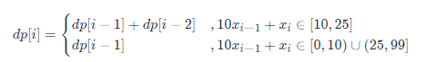
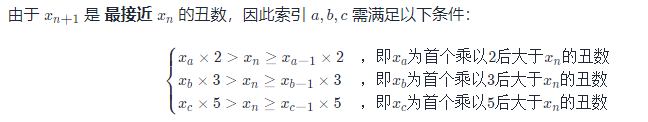
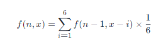
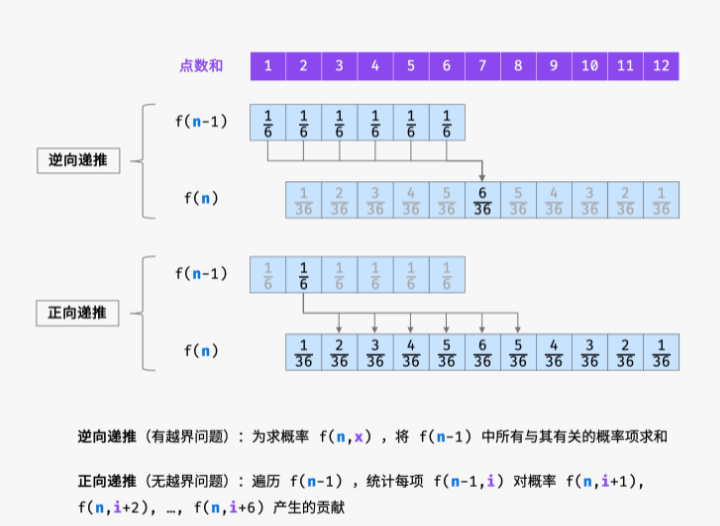

# 剑指offer

## 14.1 剪绳子

方法一：动态规划，自下而上，思路较为简单。

```python
class Solution:
    def cuttingRope(self, n: int) -> int:
        # dp数组表示长度为i的绳子剪成m段后最大长度乘积
        dp = [0] * (n + 1)
        # 初始化
        dp[2] = 1
        # 目标：求dp[n]
        for i in range(3, n + 1):
            for j in range(2, i):
                # 转移方程
                # max(j *(i - j), j * dp[i - j])是由于 减去第一段长度为j的绳子后，可以继续剪也可以不剪
                # max(dp[i], max(j *(i - j), j * dp[i - j])) 是当j不同时，求出最大的dp[i]
                dp[i] = max(dp[i], max(j *(i - j), j * dp[i - j]))
        
        return dp[n]
```

方法二：贪心算法

贪心算法的思路是：当n大于4时，尽可能多的剪出长度为3的段，当n<=4时，不再剪直接乘上即可，
是有一种自上而下的思想，具体的数学证明可以参考各位大佬的题解。

```python
class Solution:
    def cuttingRope(self, n: int) -> int:
        if n < 4: return n - 1
        a, b = n // 3, n % 3
        if b == 0:
            return int(math.pow(3, a))
        elif b == 1:
            return int(math.pow(3, a - 1) * 4)
        else:
            return int(math.pow(3, a) * 2)
		# 或者直接迭代算
        # res = 1
        # while n > 4:
        #     res *= 3
        #     n -= 3
        # return res * n
```

## 14.2 剪绳子 

贪心算法

```python
class Solution:
    def cuttingRope(self, n: int) -> int:
        MOD = 1000000007
        if n < 4: return n - 1
        a, b = n // 3, n % 3
        if b == 0:
            return int(3 ** a % MOD)
        elif b == 1:
            return int(3 ** (a - 1) * 4 % MOD)
        else: 
            return int(3 ** a * 2 % MOD)
```

> 不知道为什么不能用`math.pow`

## 15. 二进制中的1

思路：位运算

```python
class Solution:
    def hammingWeight(self, n: int) -> int:
        res = 0
        while n:
            res += n & 1
            n >>= 1
        return res
```

## 16. 数值的整数次幂

思路：快速幂

不能直接用迭代，时间复杂度太高。快速幂的关键思想还是二分法。
$$
x^n = x^{n/2} \times x^{n/2} = (x^2)^{n/2}
$$
当 n 为偶数： 
$$
x^n = (x^2)^{n//2}
$$
当 n 为奇数： 即会多出一项 x ；
$$
x^n = (x^2)^{n//2} * x
$$

```python
class Solution:
    def myPow(self, x: float, n: int) -> float:
        if n == 0: return 1
        elif n < 0:
            return 1 / x * self.myPow(1 / x, - n - 1)
        elif n % 2 == 0:
            return self.myPow(x *x, n // 2)
        elif n % 2 == 1:
            return x * self.myPow(x * x, n // 2)
        return 0
```

## 17. 打印从1到最高位n的数

方法一：列表生成式

这个方法有点取巧，这个问题考的是大数打印，而不是列表生成式

```python
class Solution:
    def printNumbers(self, n: int) -> List[int]:
        return [x for x in range(1, 10 ** n)]
```

方法二：大数打印（递归）

首先递归打印数字，然后考虑前置0的去除问题

```python
class Solution:
    def printNumbers(self, n: int) -> List[int]:
        # 递归定义：x位上的数字
        def dfs(x):
            # 前n位的数字都确定完毕
            if x == n:
                num = ''.join(nums)
                # 去除前置0
                while num.startswith('0'):
                    num = num[1:]
                if num: res.append(int(num))
                return
            for i in range(10):
                # 将x位确定为i
                nums[x] = str(i)
                # 确定x + 1的数
                dfs(x + 1)

        nums = ['0'] * n   # 初始化n位数
        res = []
        dfs(0)
        return res
```

## 18. 删除链表节点

思路：双指针法

两个指针，一个指针判断是否是要删除的节点的值

另一个节点保存前一个节点的值

```python
# Definition for singly-linked list.
# class ListNode:
#     def __init__(self, x):
#         self.val = x
#         self.next = None
class Solution:
    def deleteNode(self, head: ListNode, val: int) -> ListNode:
        if head.val == val: return head.next
        pre = ListNode(0)
        pre.next = head
        cur = pre
        while head:
            if head.val == val:
                cur.next = head.next
                break
            head = head.next
            cur = cur.next
        return pre.next
```

## 19. 正则表达式比配

思路：动态规划

[剑指 Offer 19. 正则表达式匹配（动态规划，清晰图解） - 正则表达式匹配 - 力扣（LeetCode） (leetcode-cn.com)](https://leetcode-cn.com/problems/zheng-ze-biao-da-shi-pi-pei-lcof/solution/jian-zhi-offer-19-zheng-ze-biao-da-shi-pi-pei-dong/)

```python
class Solution:
    def isMatch(self, s: str, p: str) -> bool:
        m, n = len(s) + 1, len(p) + 1
        dp = [[False] * n for _ in range(m)]
        dp[0][0] = True
        # 初始化首行
        for j in range(2, n, 2):
            dp[0][j] = dp[0][j - 2] and p[j - 1] == '*'
        # 状态转移方程
        for i in range(1, m):
            for j in range(1, n):
                if p[j - 1] == '*':
                    if dp[i][j - 2]: dp[i][j] = True
                    elif dp[i - 1][j] and s[i - 1] == p[j - 2]: dp[i][j] = True
                    elif dp[i - 1][j] and p[j - 2] == '.': dp[i][j] = True
                else:
                    if dp[i - 1][j - 1] and s[i - 1] == p[j - 1]: dp[i][j] = True
                    elif dp[i - 1][j - 1] and p[j - 1] == '.': dp[i][j] = True
        return dp[-1][-1]
```

## 20. 表示数值的字符串

思路一：有限状态自动机


**字符类型：**

​	空格 「 」、数字「 0—9 」 、正负号 「 +− 」 、小数点 「.」 、幂符号 「 eE 」 。

**状态定义：**

​	按照字符串从左到右的顺序，定义以下 9 种状态。

0. 开始的空格

1. 幂符号前的正负号

2. 小数点前的数字

3. 小数点、小数点后的数字

4. 当小数点前为空格时，小数点、小数点后的数字

5. 幂符号

6. 幂符号后的正负号

7. 幂符号后的数字

8. 结尾的空格


**结束状态：**

合法的结束状态有 2, 3, 7, 8 。

```python
class Solution:
    def isNumber(self, s: str) -> bool:
        states = [
            {' ': 0, 's': 1, 'd': 2, '.': 4},
            {'d': 2, '.': 4},
            {'d': 2, '.': 3, 'e': 5, ' ': 8},
            {'d': 3, 'e': 5, ' ': 8},
            {'d': 3},
            {'s': 6, 'd': 7},
            {'d': 7},
            {'d': 7, ' ': 8},
            {' ': 8}
        ]
        p = 0
        for c in s:
            if '0' <= c <= '9': t = 'd'
            elif c in "+-": t = 's'
            elif c in "eE": t ='e'
            elif c in ". ": t = c
            else: t = '?'
            if t not in states[p] : return False
            p = states[p][t]
        return p in (2, 3, 7, 8)
```

思路二：正则表达式

```python
class Solution:
    def isNumber(self, s: str) -> bool:
        import re
        p = re.compile(r'^[+-]?(\.\d+|\d+\.?\d*)([eE][+-]?\d+)?$')
        return bool(p.match(s.strip()))
```

## 21. 调整数组顺序使奇数在偶数前

思路：双指针法

考虑定义双指针 i , j 分列数组左右两端，循环执行：

- 指针 i 从左向右寻找偶数；
- 指针 j 从右向左寻找奇数；
- 将 偶数 nums[i] 和 奇数 nums[j] 交换。

```python
class Solution:
    def exchange(self, nums: List[int]) -> List[int]:
        i, j = 0, len(nums) - 1
        while i < j:
            if nums[i] & 1 == 0 and nums[j] & 1 != 0:
                nums[i], nums[j] = nums[j], nums[i]
                i += 1
                j -= 1
            if nums[i] & 1 != 0:
                i += 1
            if nums[j] & 1 == 0:
                j -= 1
        return nums
```

## 22. 链表中倒数第k个节点

思路：双指针法

先让fast指针走k步

之后再fast，slow一起走

```python
# Definition for singly-linked list.
# class ListNode:
#     def __init__(self, x):
#         self.val = x
#         self.next = None

class Solution:
    def getKthFromEnd(self, head: ListNode, k: int) -> ListNode:
        if not head: return None

        fast, slow = head, head
        for _ in range(k):
            fast = fast.next
        while fast:
                fast = fast.next
                slow = slow.next
        return slow
```

## 24. 反转链表

思路：双指针法：

pre：前置指针

cur：当前节点

```python
# Definition for singly-linked list.
# class ListNode:
#     def __init__(self, x):
#         self.val = x
#         self.next = None

class Solution:
    def reverseList(self, head: ListNode) -> ListNode:
        pre, cur = None, head
        while cur:
            temp = cur.next
            cur.next = pre
            pre, cur = cur, temp
        return pre
# 递归解法
class Solution:
    def reverseList(self, head: ListNode) -> ListNode:
        if not head: return None
        if not head.next: return head
        last = self.reverseList(head.next)
        head.next.next = head
        head.next = None
        return last
```

注意：可以用迭代法，但是空间复杂度不是O(1)而是O(n)。 所以不值得

## 25. 合并两个有序链表

思路：双指针法

```python
# Definition for singly-linked list.
# class ListNode:
#     def __init__(self, x):
#         self.val = x
#         self.next = None

class Solution:
    def mergeTwoLists(self, l1: ListNode, l2: ListNode) -> ListNode:
        pre = cur = ListNode(0)
        while l1 and l2:
            if l1.val <= l2.val:
                cur.next, l1 = l1, l1.next
            else:
                cur.next, l2 = l2, l2.next
            cur = cur.next
        cur.next = l1 if l1 else l2
        return pre.next
```

## 26：树的子结构

思路：递归

需要完成两步工作：

1. 遍历A树的所有节点`na`：函数`isSubStructure`
2. 判断A树中以节点`na`为根节点的子树是否包含B树：函数`recur`

函数`isSubStructure`：

1. 特例：A或者B为空，直接返回False
2. 返回值：若B是A的子结构，必满足以下几种情况
   1. 以节点`na`为根节点的树包含树B：`recur(A, B)`
   2. 节点`na`的左子树包含树B：`recur(A.left, B)`
   3. 节点`na`的右子树包含树B：`recur(A.right, B)`

函数`recur`：

1. 终止条件（base case）：

   1. 当B树为空时（B树遍历完），返回True
   2. 当A树为空时（B树还没遍历完），返回False
   3. 当节点A的值与节点B的值不同，返回False

2. 返回值

   判断A和B的左右节点是否相同`recur(A.left, B.left) and recur(A.right, B.right)`

```python
# Definition for a binary tree node.
# class TreeNode:
#     def __init__(self, x):
#         self.val = x
#         self.left = None
#         self.right = None

class Solution:
    def isSubStructure(self, A: TreeNode, B: TreeNode) -> bool:
        # isSubStructure遍历AB子树
        # recur判断节点A节点B是否相同
        def recur(A, B):
            if not B: return True
            if not A or A.val != B.val: return False
            return recur(A.left, B.left) and recur(A.right, B.right)
        
        return bool(A and B) and (recur(A, B) or self.isSubStructure(A.left, B) or self.isSubStructure(A.right, B))
        
		# 或者用更好理解的写法
		if not A or not B:
            return False
        if recur(A, B):
            return True 
        return self.isSubStructure(A.left, B) or self.isSubStructure(A.right, B)
```

## 27：二叉树的镜像

思路：递归

```python
# Definition for a binary tree node.
# class TreeNode:
#     def __init__(self, x):
#         self.val = x
#         self.left = None
#         self.right = None

class Solution:
    def mirrorTree(self, root: TreeNode) -> TreeNode:
        if not root:
            return None
        root.left, root.right = root.right, root.left
        self.mirrorTree(root.left)
        self.mirrorTree(root.right)
        return root
```

## 28：对称二叉树

思路：递归

> 注意：不要去反转二叉树之后判断与原来的二叉树是否一直，这是不对的

正确思路应是：如果一个二叉树是对称的那么一定满足：

- `L.val == R.val`左右子树的节点值相同
- `L.left.val == R.right.val` L的左子树的节点值与L的右子树的节点值相同
- `L.right.val == R.left.val` L的右子树的节点值与L的左子树的节点值相同

**算法流程**：

1. isSymmetric(root) ：

- 特例处理： 若根节点 root 为空，则直接返回 true。
- 返回值： 即 `recur(root.left, root.right)` ;

2. recur(L, R) ：

- 终止条件：
  当 L 和 R 同时越过叶节点： 此树从顶至底的节点都对称，因此返回 true ；
  当 L 或 R 中只有一个越过叶节点： 此树不对称，因此返回 false ；
  当节点 L 值 != 节点 R 值： 此树不对称，因此返回 false ；
- 递推工作：
  判断两节点 `L.left` 和 `R.right` 是否对称，即` recur(L.left, R.right) `；
  判断两节点 `L.right `和 `R.left` 是否对称，即 `recur(L.right, R.left)` ；
- 返回值： 两对节点都对称时，才是对称树，因此用与逻辑符 & 连接。

因此递归函数应该这么写：

```python
# Definition for a binary tree node.
# class TreeNode:
#     def __init__(self, x):
#         self.val = x
#         self.left = None
#         self.right = None

class Solution:
    def isSymmetric(self, root: TreeNode) -> bool:
        def dfs(L, R):
            if not L and not R:
                return None
            if not L or not R or L.val != R.val:
                return False
            return dfs(L.left, R.right) and dfs(L.right, R.left)
      	return dfs(root.left, root.right) if root else True
```

## 29: 顺时针打印矩阵

思路：模拟边界

算法流程：

1. 特例处理：如果`matrix`为空，返回`[]`
2. 初始值：矩阵上下左右四个边界分别为：`t,b,l,r`，记录返回值`res`
3. 循环过程：
   1. 根据边界循环打印，添加至res
   2. 边界向内收缩1
   3. 判断边界是否相遇（打印完毕）


```python
class Solution:
    def spiralOrder(self, matrix: List[List[int]]) -> List[int]:
        if not matrix: return []
        l, r, t, b, res = 0, len(matrix[0]) - 1, 0, len(matrix) - 1, []
        while True:
            for i in range(l, r + 1): res.append(matrix[t][i])
            t += 1
            if t > b: break
            for i in range(t, b + 1): res.append(matrix[i][r])
            r -= 1
            if r < l: break
            for i in range(r, l - 1, -1): res.append(matrix[b][i])
            b -= 1
            if b < t:break
            for i in range(b, t - 1, -1):res.append(matrix[i][l])
            l += 1
            if l > r:break
        return res
```

## 30：包含min函数的栈

思路：辅助栈

因为时间复杂度要求是O(1)

所以需要借住辅助栈来记录存储栈 *A* 中所有 **非严格降序** 的元素

```python
class MinStack:
    def __init__(self):
        """
        initialize your data structure here.
        """
        self.stack = []
        self.s = []

    def push(self, x: int) -> None:
        self.stack.append(x)
        if not self.s or self.s[-1] >= x:
            self.s.append(x)  

    def pop(self) -> None:
        if self.stack.pop() == self.s[-1]:
            self.s.pop()

    def top(self) -> int:
        return self.stack[-1]

    def min(self) -> int:
        return self.s[-1]
```

## 31: 栈的压入、弹出序列

思路：辅助栈

辅助栈按照pushed序列压入元素，当栈顶元素和popped序列元素相同时，按顺序弹出。到最后如果辅助栈为空，说明是弹出序列

```python
class Solution:
    def validateStackSequences(self, pushed: List[int], popped: List[int]) -> bool:
        stack = []
        i = 0    # popped序列索引
        for num in pushed:
            stack.append(num)
            while stack and stack[-1] == popped[i]:
                stack.pop()
                i += 1
        return not stack
```

## 32: 1 从上到下打印二叉树

思路：层序遍历（广度优先遍历BFS）

```python
# Definition for a binary tree node.
# class TreeNode:
#     def __init__(self, x):
#         self.val = x
#         self.left = None
#         self.right = None

class Solution:
    def levelOrder(self, root: TreeNode) -> List[int]:
        if not root: return []
        queue, res = collections.deque(), []
        queue.append(root)
        while queue:
            node = queue.popleft()
            res.append(node.val)
            if node.left: queue.append(node.left)
            if node.right: queue.append(node.right)
        return res
```


## 34. 二叉树中和为某一值的路径

思路：回溯法

path记录二叉树遍历路径，

target每次减去当前节点值

当target减为0且当前节点为叶子节点时，将路径path添加到结果ans中，然后回溯

```python
# Definition for a binary tree node.
# class TreeNode:
#     def __init__(self, val=0, left=None, right=None):
#         self.val = val
#         self.left = left
#         self.right = right
class Solution:
    def pathSum(self, root: TreeNode, target: int) -> List[List[int]]:
        ans, path = [], []
        def dfs(node, tar):
            if not node:
                return None
            path.append(node.val)
            tar -= node.val
            if tar == 0 and not node.left and not node.right:
                ans.append(list(path))
            dfs(node.left, tar)
            dfs(node.right, tar)
            path.pop()
        
        dfs(root, target)
        return ans
```

## 35. 复杂链表的复制

思路：哈希表

直接构建链表的话，random指针没有办法设置，所以先复制一遍节点，再连接

1. 先用哈希表复制一遍所有的节点
2. 第二遍遍历时，构建节点之间的next和random关系

```python
"""
# Definition for a Node.
class Node:
    def __init__(self, x: int, next: 'Node' = None, random: 'Node' = None):
        self.val = int(x)
        self.next = next
        self.random = random
"""
class Solution:
    def copyRandomList(self, head: 'Node') -> 'Node':
        if not head:
            return head
        dic = {}
        cur = head
        while cur:
            dic[cur] = Node(cur.val)
            cur = cur.next
        cur = head
        while cur:
            dic[cur].next = dic.get(cur.next)
            dic[cur].random = dic.get(cur.random)
            cur = cur.next
        return dic[head]
```

## 36. 二叉搜索树与双向链表

思路：中序遍历

因为二叉搜索树的中序遍历就是递增的

算法流程：

`def dfs(cur)`递归法中序遍历：

1. 终止条件：当节点cur为空时，越过叶子节点，直接返回
2. 递归左子树，`dfs(cur.left)`
3. 构建链表：
   1. 当pre为空时，当前节点在根节点，标记head
   2. 当pre不为空时，构建双向链表，`pre.right = cur`，`cur.left = pre`
   3. 移动pre，`pre = cur`
4. 递归右子树

`def treeToDoublyList(root):`

1. 特例处理：root节点为空，直接返回
2. 初始化：pre为空节点
3. 转化双向链表`dfs(root)`
4. 构建循环链表，`head.left = pre`，`pre.right = head`
5. 返回head节点

```python
"""
# Definition for a Node.
class Node:
    def __init__(self, val, left=None, right=None):
        self.val = val
        self.left = left
        self.right = right
"""
class Solution:
    def treeToDoublyList(self, root: 'Node') -> 'Node':
        def dfs(cur):
            if not cur:
                return None
            dfs(cur.left)   #递归左子树
            if self.pre:    #修改节点
                self.pre.right, cur.left = cur, self.pre
            else:    #记录头结点
                self.head = cur
            self.pre = cur
            dfs(cur.right)
        
        if not root:
            return None
        self.pre = None
        dfs(root)
        self.head.left, self.pre.right = self.pre, self.head
        return self.head
```

## 37. 二叉树的序列化与反序列化

思路一：前序遍历

```python
# Definition for a binary tree node.
# class TreeNode(object):
#     def __init__(self, x):
#         self.val = x
#         self.left = None
#         self.right = None

class Codec:

    def serialize(self, root):
        """Encodes a tree to a single string.
        
        :type root: TreeNode
        :rtype: str
        """
        res = []
        def ser(root):
            if not root:
                return res.append('null')
            else:
                res.append(str(root.val))
                ser(root.left)
                ser(root.right)
        ser(root)
        res = ','.join(res)
        return res   

    def deserialize(self, data):
        """Decodes your encoded data to tree.
        
        :type data: str
        :rtype: TreeNode
        """
        if not data:
            return []
        data_s = data.split(',')
        def deser(nodes):
            val = nodes[0]
            del nodes[0]
            if val == 'null':
                return None
            val = int(val)
            root = TreeNode(val)
            root.left = deser(nodes)
            root.right = deser(nodes)
            return root
        root = deser(data_s)
        return root  

# Your Codec object will be instantiated and called as such:
# codec = Codec()
# codec.deserialize(codec.serialize(root))
```

思路二：层序遍历

```python
# Definition for a binary tree node.
# class TreeNode(object):
#     def __init__(self, x):
#         self.val = x
#         self.left = None
#         self.right = None

class Codec:

    def serialize(self, root):
        """Encodes a tree to a single string.
        
        :type root: TreeNode
        :rtype: str
        """
        if not root:
            return '[]'
        res = []
        queue = collections.deque()
        queue.append(root)
        while queue:
            node = queue.popleft()
            if node:
                res.append(str(node.val))
                queue.append(node.left)
                queue.append(node.right)
            else:
                res.append('null')
        return '[' + ','.join(res) + ']'
        
    def deserialize(self, data):
        """Decodes your encoded data to tree.
        
        :type data: str
        :rtype: TreeNode
        """
        if data == '[]':
            return []
        vals, i = data[1:-1].split(','), 1
        root = TreeNode(int(vals[0]))
        queue = collections.deque()
        queue.append(root)
        while queue:
            node = queue.popleft()
            if vals[i] != 'null':
                node.left = TreeNode(int(vals[i]))
                queue.append(node.left)
            i += 1
            if vals[i] != 'null':
                node.right = TreeNode(int(vals[i]))
                queue.append(node.right)
            i += 1
        return root     

# Your Codec object will be instantiated and called as such:
# codec = Codec()
# codec.deserialize(codec.serialize(root))
```

## 38. 字符串的排列

思路：回溯

```python
class Solution:
    def permutation(self, s: str) -> List[str]:
        c, res = list(s), []
        def dfs(x):
            if x == len(c) - 1:
                res.append(''.join(c))    # 添加排列方案
                return
            dic = set()
            for i in range(x, len(c)):
                if c[i] in dic: continue    # 重复，剪枝
                dic.add(c[i])
                c[i], c[x] = c[x], c[i]    # 交换，将c[i]固定在第x位
                dfs(x + 1)                 # 开启固定第x + 1位
                c[i], c[x] = c[x], c[i]    # 恢复交换
        dfs(0)
        return res
```

## 39. 数组中出现次数最多的数

思路：哈希表

注意：max函数key的使用

时间复杂度：o（n），

空间复杂度：o（n）

```python
class Solution:
    def majorityElement(self, nums: List[int]) -> int:
        s = Counter(nums)
        return max(s.keys(), key=s.get)
```

思路二：摩尔投票法

找出数组中超过一半的数

算法流程：

1. 初始化： 票数统计 votes = 0 ， 众数 x；
2. 循环： 遍历数组 nums 中的每个数字 num ；
   1. 当 票数 votes 等于 0 ，则假设当前数字 num 是众数；
   2. 当 `num = x` 时，票数 votes 自增 1 ；当 `num != x` 时，票数 votes 自减 1 ；

3. 返回值： 返回 x 即可；

```python
class Solution:
    def majorityElement(self, nums: List[int]) -> int:
        votes = 0
        for num in nums:
            if votes == 0:
                x = num
            votes += 1 if num ==x else -1
        return x
```

时间复杂度：o（n），

空间复杂度：o（1）

## 40. 最小的k个数

思路：`sort()`

```python
class Solution:
    def getLeastNumbers(self, arr: List[int], k: int) -> List[int]:
        arr.sort()
        return arr[:k]
```

思路：快速排序

```python
class Solution:
    def getLeastNumbers(self, arr: List[int], k: int) -> List[int]:
        def quick_sort(arr, l, r):
            if l >= r:
                return 
            i, j = l, r
            while i < j:
                while i < j and arr[j] >= arr[l]: j -= 1
                while i < j and arr[i] <=arr[l]: i += 1
                arr[i], arr[j] = arr[j], arr[i]
            arr[i], arr[l] = arr[l], arr[i]
            quick_sort(arr, l, i - 1)
            quick_sort(arr, i + 1, r)
        
        quick_sort(arr, 0, len(arr) - 1)
        return arr[:k]
```

## 41. 数据流中的中位数

思路：优先级队列，堆

> 首先对于一个给定的长度为N的无序数组，中位数的计算方法：首先对数组执行排序O(NlogN)，然后返回中间元素。

可以在添加元素时就保持数组有序，时间复杂度为O(N)：查找元素插入位置O(logN)（二分查找），向数组某位置插入元素O(N)（插入位置后，每个元素都要向后移动）

> 借住堆进一步优化时间复杂度

建立一个小顶堆A和大顶堆B，各保存列表一般的元素：

- A保存较大的一半，长度为 N/2（N为偶数）或 （N+1）/2（N为奇数）
- B保存较小的一半，长度为 N/2（N为偶数）或 （N-1）/2（N为奇数）

中位数可以通过A、B堆顶元素计算得到

`addNum(num)` 函数：

1. 当`m=n`（即 N 为 偶数）：需向 A 添加一个元素。实现方法：将新元素 `num` 插入至 B ，再将 B 堆顶元素插入至 A ；
2. 当 `m \ n`（即 N 为 奇数）：需向 B 添加一个元素。实现方法：将新元素 `num` 插入至 A ，再将 A 堆顶元素插入至 B ；

`findMedian()` 函数：

1. 当 `m=n`（ N 为 偶数）：则中位数为 (( A 的堆顶元素 + B 的堆顶元素 )/2。
2. 当 `m \ n`（ N 为 奇数）：则中位数为 A 的堆顶元素。

```python
from heapq import *

class MedianFinder:

    def __init__(self):
        """
        initialize your data structure here.
        """
        self.A = [] # 小顶堆，存较大的一半
        self.B = [] # 大顶堆，存较小的一半

    def addNum(self, num: int) -> None:
        if len(self.A) != len(self.B):
            heappush(self.B, -heappushpop(self.A, num))
        else:
            heappush(self.A, -heappushpop(self.B, -num))

    def findMedian(self) -> float:
        return self.A[0] if len(self.A) != len(self.B) else (self.A[0] - self.B[0]) / 2.0

# Your MedianFinder object will be instantiated and called as such:
# obj = MedianFinder()
# obj.addNum(num)
# param_2 = obj.findMedian()
```

## 42. 连续子数组的最大和

思路：动态数组、前缀和思想

```python
class Solution:
    def maxSubArray(self, nums: List[int]) -> int:
        maxs = cur = nums[0]
        pre = 0
        for num in nums:
            cur = num
            if pre > 0:
                cur += pre
            if cur > maxs:
                maxs = cur
            pre = cur
        return maxs
```


## 45. 把数组排成最小的数

思路：快速排序

```python
class Solution:
    def minNumber(self, nums: List[int]) -> str:
        def qiuck_sort(l, r):
            if l >= r: return 
            i, j = l, r
            while i < j:
                while strs[j] + strs[l] >= strs[l] + strs[j] and i < j: j -= 1
                while strs[i] + strs[l] <= strs[l] + strs[i] and i < j:i += 1
                strs[i], strs[j] = strs[j], strs[i]
            strs[i], strs[l] = strs[l], strs[i]
            qiuck_sort(l, i - 1)
            qiuck_sort(i + 1, r)
        
        strs = [str(num) for num in nums]
        qiuck_sort(0, len(strs) - 1)
        return ''.join(strs)
```


## 46. 把数字翻译成字符串

思路：动态规划

> 数字num的第i位数字为xi，数字num的位数为n

**状态定义：**动态规划列表dp，dp[i]代表以xi为结尾的数字的翻译方案数量

**转移方程：**

​    若`xi`和`xi-1`组成的两位数字可以被翻译，则`dp[i]=dp[i-1]+dp[i-2]`；否则`dp[i]=dp[i-1]`

​    其中当可以被翻译时，xi-1不可以为0（00，01,02不可被翻译）

​	

**初始状态：**dp[0] = dp[1] = 1，即无数字和第一位数字的翻译方法数量为1

**返回值：**dp[n]

```python
class Solution:
    def translateNum(self, num: int) -> int:
        s = str(num)
        a = b = 1
        for i in range(2, len(s) + 1):
            a, b = (a + b if '10' <= s[i - 2 : i] <= '25' else a), a
        return a
```


## 47. 礼物的最大价值

思路：动态规划

**状态定义：**`dp[i][j]`是从左上角来时到（i,j）能拿到最大的礼物路线

**转移方程：**

- 当 i=0 且 j=0 时，就是左上角，即是`grid[i][j]`
- 当 i=0 但 j!=0 时，是第一行，直接累加即可
- 当 i!=0 但 j=0 时，是第一列，累加
- 当i!=0 且 j!=0 时，`dp[i][j] = max(dp[i - 1][j], dp[i][j - 1]) + grid[i][j]`

**初始状态：**即`dp[0][0] = grid[0][0]`

**返回值：**`dp[m-1][n-1]`

空间复杂度优化：

由于`dp[i][j]只与dp[i - 1][j], dp[i][j - 1]， grid[i][j]`有关，可以将grid矩阵作为dp矩阵。

此法将空间复杂度从o(MN)变为o(1)

```python
class Solution:
    def maxValue(self, grid: List[List[int]]) -> int:
        for i in range(len(grid)):
            for j in range(len(grid[0])):
                if i == 0 and j == 0: continue
                elif i == 0: grid[i][j] += grid[i][j - 1]
                elif j == 0: grid[i][j] += grid[i - 1][j]
                else: grid[i][j] += max(grid[i - 1][j], grid[i][j - 1])
        return grid[-1][-1]
```


方法二：思路：动态规划

但是dp数组多加一行一列

这样虽然时间复杂度和空间复杂度都变高，但是可以不用考虑边界问题，代码很简洁易懂。

```python
class Solution:
    def maxValue(self, grid: List[List[int]]) -> int:
        m = len(grid)
        n = len(grid[0])
        dp = [[0] * (n + 1) for _ in range(m + 1)]
        dp[0][0] = grid[0][0]
        for i in range(1, m + 1):
            for j in range(1, n + 1):
                dp[i][j] = max(dp[i - 1][j], dp[i][j - 1]) + grid[i - 1][j - 1]
        return dp[m][n]
```


## 48. 最长不含重复字符的子字符串

思路：双指针法（滑动窗口）

```python
class Solution:
    def lengthOfLongestSubstring(self, s: str) -> int:
        dic, res, i = {}, 0, -1
        for j in range(len(s)):
            if s[j] in dic:
                i = max(dic[s[j]], i)
            dic[s[j]] = j
            res = max(res, j - i)
        return res
```


## 49. 丑数

思路：动态规划

> 丑数的递推性质： 丑数只包含因子 2, 3, 5 ，因此有 “丑数 = 某较小丑数 × 某因子” （例如：10=5×2）。

丑数递推公式：
$$
x_{n+1}=min(x_a×2,x_b×3,x_c×5)
$$


**状态定义：**dp[i]是第i+ 1个丑数

**转移方程：**`dp[i] = min(dp[a] *2, dp[b]*3, dp[c] * 5)`

每轮计算过后，都要更新a,b,c的值，使其满足索引条件。实现方法：分别判断dp[a] *2, dp[b]*3, dp[c] * 5是否与dp[i]相等，若相等则+1

**初始状态：**dp[0] = 1，即第一个丑数是1

**返回值：**dp[n-1]， 即第n 个丑数

```python
class Solution:
    def nthUglyNumber(self, n: int) -> int:
        dp, a, b, c = [1] * n, 0, 0, 0
        for i in range(1, n):
            n2, n3, n5 = dp[a] * 2, dp[b] * 3, dp[c] * 5
            dp[i] = min(n2, n3, n5)
            if dp[i] == n2: a += 1
            if dp[i] == n3: b += 1
            if dp[i] == n5: c += 1
        return dp[-1]
```


## 50. 第一个只出现一次的字符

思路：哈希表，有序哈希表

> python3.6之后 字典就是有序的了。不需要特别设置

**初始化：**字典

**字符统计：**统计是否是唯一一次出现在字符串中。

**返回：**字典中第一个`value = true`的key

```python
class Solution:
    def firstUniqChar(self, s: str) -> str:
        res = {}
        for c in s:
            res[c] = not c in res
        for k, v in res.items():
            if v: return k
        return ' '
```


## 51. 数组中的逆序对

思路：归并排序（分治思想）

`merge_sort()`归并排序与逆序对统计：

1. **终止条件：**当`l<r`时，代表子数组长度为1，划分终止
2. **递归划分：**计算数组中点，递归划分`merge_sort(l, mid)`和`merge_sort(mid +1, r)`
3. **合并与逆序对统计：**
   1. 暂存数组nums闭区间[l,r]至辅助数组temp
   2. 循环合并：设置双指针`i,j`分别指向左右子数组首元素
      - 当`i=m+1`时，左子数组合并完毕，添加右子数组至temp[j]，`j+=1`
      - 否则，当`j=r+1`时，右子数组合并完毕，添加左子数组至temp[i]，`i+=1`
      - 否则，当`temp[i] <temp[j]`时，添加左子数组元素至temp[i]，`i+=1`
      - 否则，当`temp[i] >temp[j]`，添加右子数组元素至temp[j]，`j+=1`，并且计算逆序对数目：m-i+1，添加至res
4. **返回值：**res

`reversePairs()`主函数

1. **初始化：**辅助数组temp
2. **返回值：**执行归并排序，返回逆序对总数

```python
class Solution:
    def reversePairs(self, nums: List[int]) -> int:
        def merge_sort(l, r):
            # 终止条件
            if l >= r: return 0
            m = (l + r) // 2
            res = merge_sort(l, m) + merge_sort(m + 1, r)
            # 合并阶段
            i, j = l, m + 1
            temp[l: r + 1] = nums[l: r + 1]
            for k in range(l, r + 1):
                if i == m + 1:
                    nums[k] = temp[j]
                    j += 1
                elif j == r + 1 or temp[i] <= temp[j]:
                    nums[k] = temp[i]
                    i += 1
                else:
                    nums[k] = temp[j]
                    j += 1
                    res += m - i + 1 # 统计逆序对
            return res
        temp = [0] * len(nums)
        return merge_sort(0, len(nums) - 1)
```


## 52. 两个链表的第一个共同节点

 思路：双指针法（空间复杂度o(1)第一个想到这个方法）

A链表共同节点前长度L1，B链表共同节点前长度L2，共同节点长度c

因此利用L1+ L2+c=L2+c+L1

A指针遍历完A链表后遍历B链表

B指针遍历完B链表后遍历A链表

当两个指针重合是就是第一个共同节点，返回A即可

注：当两个链表没有共同节点的时候，在null处AB重合，仍然返回A即可

```python
class Solution:
    def getIntersectionNode(self, headA: ListNode, headB: ListNode) -> ListNode:
        node1, node2 = headA, headB

        while node1 != node2:
            node1 = node1.next if node1 else headB
            node2 = node2.next if node2 else headA
        return node1
```


## 53. 在排序数组中查找一个数

思路：二分法

写一个helper函数，来找target在nums中的右边界，然后返回`halper(target) - helper(target - 1)`

```python
class Solution:
    def search(self, nums: List[int], target: int) -> int:
        def helper(tar):
            i, j = 0, len(nums) - 1
            while i <= j:
                m = (i + j) // 2
                if nums[m] <= tar:
                    i = m + 1
                else:
                    j = m - 1
            return i
        return helper(target) - helper(target - 1)
```


## 53.2 0-n-1中缺失的数字

思路：二分法

```python
class Solution:
    def missingNumber(self, nums: List[int]) -> int:
        i, j = 0, len(nums) - 1
        
        while i <= j:
            m = (i + j) // 2
            if nums[m] != m:
                j = m - 1
            else:
                i = m + 1
        return i
```


## 54. 二叉搜索树中第k大的节点

思路：中序遍历 倒序 + 提前终止

中序遍历：左 根 右 -> 递增序列

中序遍历倒序： 右 根 左 -> 递减序列

**递归函数：**

1. 终止条件：当节点root为空，则返回
2. 递归右子树：dfs(node.right)
3. 当前节点工作：
   1. 判断是否提前返回：若`k==0`，则返回
   2. `k -= 1`
   3. 判断k是否为0，若是，记录`res = node.val`
4. 递归左子树：dfs(node.left)

```python
class Solution:
    def kthLargest(self, root: TreeNode, k: int) -> int:
        def dfs(node):
            if not node: return

            dfs(node.right)
            if self.k == 0: return
            self.k -= 1
            if self.k == 0: self.res = node.val
            dfs(node.left)
        
        self.k = k
        dfs(root)
        return self.res
```

注：

- 这题直接用中序遍历也可以做，但是用时就会多很多。
- 二叉树的遍历方法不是固定死的，可以灵活变化。
- 提前终止也可以节省很多时间


## 55. 二叉树的深度

方法一：思路：回溯算法

```python
class Solution:
    def maxDepth(self, root: TreeNode) -> int:
        self.depth = 0
        self.res = 0

        def dfs(node):
            if not node: return 
            self.depth += 1
            self.res = max(self.res, self.depth)
            dfs(node.left)
            dfs(node.right)
            self.depth -= 1
        dfs(root)
        return self.res
```

方法二：思路：动态规划

```python
class Solution:
    def maxDepth(self, root: TreeNode) -> int:
        if not root: return 0
        leftdepth = self.maxDepth(root.left)
        rightdepth = self.maxDepth(root.right)
        return 1 + max(leftdepth, rightdepth)
```


## 55.2 平衡二叉树

思路：后序遍历

```python
class Solution:
    def isBalanced(self, root: TreeNode) -> bool:  
        def recur(root):
            if not root: return 0
            left = recur(root.left)
            if left == -1: return -1
            right = recur(root.right)
            if right == -1: return -1
            return max(left, right) + 1 if abs(left - right) <= 1 else -1
        return recur(root) != -1
```


## 56. 数组中数字出现的次数

思路：位运算

> 当数组中只有一个数字出现一次时，其他数字都出现两次时，可以用异或运算来找到这个数。

但是本题是有两个数字，所以 需要找一个数把数组分为两个子数组，分别包含一个只出现一次的数字。

算法思路：

1. 遍历数组，做异或运算，最终的结果是 `z = x ^ y`
2. x, y两个数必定有一位不相同，所以做循环移位，找到 x, y 第一个不相同的低位 m
3. 通过m将数组分为两个子数组，分别是与第 m 位相同的， 和不相同的
4. 分别做异或运算，得到 x, y ，最后返回

```python
class Solution:
    def singleNumbers(self, nums: List[int]) -> List[int]:
        x, y, m, n = 0, 0, 1, 0
        for num in nums:
            n ^= num
        while n & m == 0:
            m <<= 1
        for num in nums:
            if num & m: x ^= num
            else: y ^= num
        return [x, y]
```


## 56.2 数组中数字出现的次数

思路：位运算

所有数字的二进制位分别求和，各位置求3的余数，就可以得到只出现1次的数字

```python
class Solution:
    def singleNumber(self, nums: List[int]) -> int:
        count = [0] * 32
        for num in nums:
            for j in range(32):
                count[j] += num & 1
                num >>= 1
        res, m = 0, 3
        for i in range(32):
            res <<= 1
            res |= count[31 - i] % m
        return res if count[31] % m == 0 else ~(res ^ 0xffffffff)
```


## 57. 和为s的两数

思路一：二分法

时间复杂度：o(NlogN)

空间复杂度：o(1)，只使用了 l,r,m

```python
class Solution:
    def twoSum(self, nums: List[int], target: int) -> List[int]:
        for i in range(len(nums)):
            l, r = i, len(nums) - 1
            while l <= r:
                m = l + (r - l) // 2
                if nums[m] < target - nums[i]:
                    l = m + 1
                if nums[m] > target - nums[i]:
                    r = m - 1
                if nums[m] == target - nums[i]:
                    return [nums[i], nums[m]]
```

思路二：双指针法

时间复杂度：o(N)

空间复杂度：o(1)

```python
class Solution:
    def twoSum(self, nums: List[int], target: int) -> List[int]:
        i, j = 0, len(nums) - 1
        while i < j:
            s = nums[i] + nums[j]
            if s < target:
                i += 1
            elif s >  target:
                j -= 1
            else:
                return [nums[i], nums[j]]
        return []
```


## 57.2 和为s的正数序列

思路：双指针法

```python
class Solution:
    def findContinuousSequence(self, target: int) -> List[List[int]]:
        i, j, s, res = 1, 2, 3, []
        while i < j:
            if s == target:
                res.append(list(range(i, j + 1)))
            if s >= target :
                s -= i
                i += 1
            else:
                j += 1
                s += j
        return res
```


## 58. 翻转单词顺序

思路一：库函数（面试不推荐）

```python
class Solution:
    def reverseWords(self, s: str) -> str:
        s = s.strip() # 删除首尾空格
        strs = s.split() # 分割字符串
        strs.reverse() # 翻转单词列表
        return ' '.join(strs) # 拼接为字符串并返回

# 一行版本
class Solution:
    def reverseWords(self, s: str) -> str:
        return ' '.join(s.strip().split()[::-1])
```

思路二：双指针法

1. 倒序遍历字符串，记录单词边界i,j
2. 将单词加入res
3. res数组拼接

```python
class Solution:
    def reverseWords(self, s: str) -> str:
        s = s.strip()
        i = j = len(s) - 1
        res = []
        while i >= 0 :
            while i >= 0 and s[i] != ' ': i -= 1    # 搜索首个空格
            res.append(s[i + 1: j + 1])
            while i >= 0 and s[i] == ' ': i -= 1    # 跳过单词间空格
            j = i                                   # 指向下个单词结尾的指针
        return ' '.join(res)
```


## 59. 滑动窗口的最大值

思路一：暴力

时间复杂度：o(nk)，n是nums长度，k是窗口长度

```python
class Solution:
    def maxSlidingWindow(self, nums: List[int], k: int) -> List[int]:
        i, j = 0, k - 1
        res = []
        if len(nums) == 0:
            return []
        while j < len(nums):
            res.append(max(nums[i : j + 1]))
            i += 1
            j += 1
        return res
```

思路二：优先队列（堆）

```python
class Solution:
    def maxSlidingWindow(self, nums: List[int], k: int) -> List[int]:
        if not nums or k == 0: return []
        deque = collections.deque()
        # 未形成窗口
        for i in range(k):
            while deque and deque[-1] < nums[i]:
                deque.pop()
            deque.append(nums[i])
        res = [deque[0]]
        # 形成窗口后
        for i in range(k, len(nums)):
            if deque[0] == nums[i - k]:
                deque.popleft()
            while deque and deque[-1] < nums[i]:
                deque.pop()
            deque.append(nums[i])
            res.append(deque[0])
        return res
```


## 59.2 队列的最大值

思路：单调双端队列

因为插入、删除和最大值都需要O(1)的时间复杂度，所以一般的队列并不能完成任务。

需要一个辅助双端队列，记录单调不增队列，因为该结构只会从尾端添加、从前端删除，所以在最大值前面加入的值在删除时，并不会影响max函数，只需要记录后面递减的顺序即可。

```python
import queue
class MaxQueue:

    def __init__(self):
        self.deque = queue.deque()
        self.queue = queue.Queue()

    def max_value(self) -> int:
        return self.deque[0] if self.deque else -1

    def push_back(self, value: int) -> None:
        while self.deque and self.deque[-1] < value:
            self.deque.pop()
        self.deque.append(value)
        self.queue.put(value)

    def pop_front(self) -> int:
        if not self.deque:
            return -1
        ans = self.queue.get()
        if ans == self.deque[0]:
            self.deque.popleft()
        return ans
```


## 60. n个筛子的点数

思路：动态规划

暴力法的时间复杂度是O(6^n)，肯定不行

首先，给定n个筛子，可得：

- 每个筛子摇到1-6的概率都相等，为1/6
- n个筛子的点数和范围为[n,6n]，一共有5n+1种可能

> 设输入 n 个骰子的解（即概率列表）为 *f(n)*，其中「点数和」 *x* 的概率为*f*(*n*,*x*) 。





```python
class Solution:
    def dicesProbability(self, n: int) -> List[float]:
        dp = [1 / 6] * 6
        for i in range(2, n + 1):
            temp = [0] * (5 * i + 1)
            for j in range(len(dp)):
                for k in range(6):
                    temp[j + k] += dp[j] / 6
            dp = temp
        return dp
```


## 61. 扑克牌中的顺子

思路：集合+遍历

最关键的点在于如何能称为顺子，需要满足以下两点：

- 没有重复的牌（大小王除外）
- 最大牌 - 最小牌 < 5

```python
class Solution:
    def isStraight(self, nums: List[int]) -> bool:
        s = set()
        max_, min_ = 0, 14
        for num in nums:
            if num == 0: continue        # 跳过大小王
            max_ = max(max_, num)
            min_ = min(min_, num)
            if num in s: return False    # 若干有重复直接退出
            s.add(num)
        return max_ - min_ < 5           # 最大牌-最小牌 < 5 即可凑成顺子
```


## 62. 圆圈中最后剩下的数字：

思路：动态规划、递归


官方解答就扔了个公式，还写错了(划掉，官解没错了，因为。。它改了)，然后就得结论了。我们现在来捋一捋这公式到底咋推出来的。

我们有n个数，下标从0到n-1，然后从`index=0`开始数，每次数m个数，最后看能剩下谁。我们假设能剩下的数的**下标**为y，则我们把这件事表示为

```
f(n,m) = y
```

这个y到底表示了啥呢？注意，y是下标，所以就意味着你从`index=0`开始数，数y+1个数，然后就停，停谁身上谁就是结果。

行了，我们假设`f(n-1,m)=x`，然后来找一找`f(n,m)`和`f(n-1,m)`到底啥关系。

`f(n-1,m)=x`意味着啥呢？意味着有n-1个数的时候从`index=0`开始数，数x+1个数你就找到这结果了。那我不从`index=0`开始数呢？比如我从`index=i`开始数？那很简单，你把上面的答案也往后挪i下，就得到答案了。当然了，你要是挪到末尾了你就取个余，从头接着挪。

于是我们来思考`f(n,m)`时考虑以下两件事：

1. 有n个数的时候，要划掉一个数，然后就剩n-1个数了呗，那划掉的这个数，**下标**是多少？
2. 划完了这个数，往后数，数x+1个数，停在谁身上谁就是我们的答案。当然了，数的过程中你得取余

**问题一**：有n个数的时候，划掉了谁？**下标**是多少？

因为要从0数m个数，那最后肯定落到了下标为m-1的数身上了，但这个下标可能超过我们有的最大下标（n-1）了。所以攒满n个就归零接着数，逢n归零，所以要模n。

所以有n个数的时候，我们划掉了下标为`(m-1)%n`的数字。

**问题二**：我们划完了这个数，往后数x+1下，能落到谁身上呢，它的下标是几？

你往后数x+1，它下标肯定变成了`(m-1)%n +x+1`，和第一步的想法一样，你肯定还是得取模，所以答案为`[(m-1)%n+x+1]%n`，则

```erlang
f(n,m)=[(m-1)%n+x+1]%n
```

其中`x=f(n-1,m)`

我们化简它！

定理一：两个正整数a，b的和，模另外一个数c，就等于它俩分别模c，模完之后加起来再模。

```perl
(a+b)%c=((a%c)+(b%c))%c
```

定理二：一个正整数a，模c，模一遍和模两遍是一样的。

```
a%c=(a%c)%c
```

你稍微一琢磨就觉得，嗯，说得对。

所以

```perl
f(n,m)=[(m-1)%n+x+1]%n
      =[(m-1)%n%n+(x+1)%n]%n
      =[(m-1)%n+(x+1)%n]%n
      =(m-1+x+1)%n
      =(m+x)%n
```

带入`x=f(n-1,m)`，可得：

```perl
f(n,m) = (f(n-1,m) + m) % n
```

```python
class Solution:
    def lastRemaining(self, n: int, m: int) -> int:
        x = 0
        for i in range(2, n + 1):
            x = (x + m) % i
        return x
```


## 63. 买卖股票

思路：动态规划

最基本的动态规划框架：

```python
class Solution:
    def maxProfit(self, prices: List[int]) -> int:
        if not prices: return 0
        n = len(prices)
        dp = [0] * n
        for i in range(1, n):
            dp[i] = max(dp[i - 1], prices[i] - min(prices[:i]))
        return dp[n - 1]
```

时间复杂度优化：用cost记录最低的价格，这样就不用每次循环都求一次min

空间复杂度优化：因为dp[i]只与dp[i - 1]，price，cost有关，可以用profit来迭代记录。

```python
class Solution:
    def maxProfit(self, prices: List[int]) -> int:
        cost, profit = float("+inf"), 0
        for price in prices:
            cost = min(cost, price)
            profit = max(profit, price - cost)
        return profit
```

