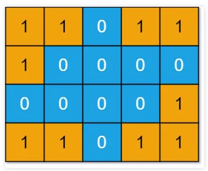

#  每日一题

## 21.10.18 

### 476题 数字的补数

自己想的，先求二进制，然后从后遍历，遇到0就乘上2的相应幂数

```python
class Solution:
    def findComplement(self, num: int) -> int:
        num_b = bin(num)[2:]

        res = 0
        for i, s in enumerate(num_b[::-1]):
            if s == '0':
                res += (2 **i)

        return res
```

位运算

求补数最好的办法就是直接与0x7fffffff求异或，不过题目额外要求我们无视前导零位，需要先找到num最高位1的位置i，再与2**(i + 1) - 1异或

```python
class Solution:
    def findComplement(self, num: int) -> int:
        highbit = 0
        for i in range(1, 30 + 1):
            if num >=(1 << i):
                highbit = i
            else:
                break
        mask = (1 << (highbit + 1)) - 1

        return num ^ mask
```

## 21.10.19 

### 208题：实现Trie树 字典树 前缀树

Trie，又称前缀树或字典树，是一棵有根树，其每个节点包含以下字段：

- 指向子节点的指针数组 `children`。对于本题而言，数组长度为 26，即小写英文字母的数量。此时`children[0]` 对应小写字母 a，`children[1] `对应小写字母 b，…，`children[25] `对应小写字母 z。
- 布尔字段 `isEnd`，表示该节点是否为字符串的结尾。

```python
class Trie:

    def __init__(self):
        self.children = [None] * 26
        self.isEnd = False

    def searchPrefix(self, prefix):
        node = self
        for ch in prefix:
            ch = ord(ch) - ord('a')
            if not node.children[ch]:
                return None
            node = node.children[ch]
        return node

    def insert(self, word: str) -> None:
        node = self
        for ch in word:
            ch = ord(ch) - ord('a')
            if not node.children[ch]:
                node.children[ch] = Trie()
            node = node.children[ch]
        node.isEnd = True

    def search(self, word: str) -> bool:
        node = self.searchPrefix(word)
        return node is not None and node.isEnd

    def startsWith(self, prefix: str) -> bool:
        return self.searchPrefix(prefix) is not None

```

### 字典树应用：211题：添加与搜索单词

```python
class TrieNode:
    def __init__(self):
        self.children = [None] * 26
        self.isEnd = False

    def insert(self, word):
        node = self
        for ch in word:
            ch = ord(ch) - ord('a')
            if not node.children[ch]:
                node.children[ch] = TrieNode()
            node = node.children[ch]
        node.isEnd = True
    

class WordDictionary:

    def __init__(self):
        self.trieRoot = TrieNode()

    def addWord(self, word: str) -> None:
        self.trieRoot.insert(word)

    def search(self, word: str) -> bool:

        def dfs(index, node):
            if index == len(word):
                return node.isEnd
            ch = word[index]

            if ch != '.':
                child = node.children[ord(ch) - ord('a')]
                if child is not None and dfs(index + 1, child):
                    return True
            else:
                for child in node.children:
                    if child is not None and dfs(index + 1, child):
                        return True
            return False

        return dfs(0, self.trieRoot)

# Your WordDictionary object will be instantiated and called as such:
# obj = WordDictionary()
# obj.addWord(word)
# param_2 = obj.search(word)
```


## 21.10.20 

### 453题： 最小操作次数使数组元素相等

这题需要转换一下思路：

每次操作既可以理解为使 `n − 1` 个元素增加 1，也可以理解使 1 个元素减少 1。

转换思路之后只要计算每个数跟最小值之间的差距就可以了

```python
class Solution:
    def minMoves(self, nums: List[int]) -> int:
        min_num = min(nums)
        count = 0
        for num in nums:
            count += num - min_num
        return count
```

### 200题：岛屿问题

**岛屿系列问题的核心考点就是用 DFS/BFS 算法遍历二维数组！！！**

完全可以根据二叉树的遍历框架改写出二维矩阵的 DFS 代码框架：

```python
# dfs 二叉树遍历
def traverse(root: TreeNode):
    traverse(root.left)
    traverse(root.right)

# 二维矩阵遍历
"""
因为二维矩阵本质上是一幅「图」，所以遍历的过程中需要一个`visited`布尔数组防止走回头路，如果你能理解上面这段代码，那么搞定所有岛屿问题都很简单。
"""
def dfs(grid, i, j, visited):
    m, n = len(grid), len(grid[0])
    if i < 0 or j < 0 or i >= m or j >= n:
        return
    if visited[i][j]:
        return
    visited[i][j] = True
    dfs(grid, i - 1, j)
    dfs(grid, i + 1, j)
    dfs(grid, i, j - 1)
    dfs(grid, i, j + 1)
    visited[i][j] = False
      
```


题目会输入一个二维数组`grid`，其中只包含`0`或者`1`，`0`代表海水，`1`代表陆地，且假设该矩阵四周都是被海水包围着的。

我们说连成片的陆地形成岛屿，那么请你写一个算法，计算这个矩阵`grid`中岛屿的个数

比如说题目给你输入下面这个`grid`有四片岛屿，算法应该返回 4：



```python
class Solution:
    def numIslands(self, grid: List[List[str]]) -> int:
        def dfs(grid, i, j):
            m, n = len(grid), len(grid[0])
            if i < 0 or j < 0 or i >= m or j >= n:
                # 超出索引边界
                return
            if grid[i][j] == '0':
                # 已经是水
                return 
            # 将grid[i][j]变成水
            grid[i][j] = '0'
            # 淹没上下左右的陆地
            dfs(grid, i + 1, j)
            dfs(grid, i, j + 1)
            dfs(grid, i - 1, j)
            dfs(grid, i, j - 1)
            
        res = 0
        m, n = len(grid), len(grid[0])
        for i in range(m):
            for j in range(n):
                # 每发现一个岛屿，岛屿数量加一
                if grid[i][j] == '1':
                    res += 1
                    # 然后使用 DFS 将岛屿淹了
                    dfs(grid, i, j)
        return res
```


## 21.10.21

### 66题：加一

给定一个由 整数 组成的 非空 数组所表示的非负整数，在该数的基础上加一。

最高位数字存放在数组的首位， 数组中每个元素只存储单个数字。

你可以假设除了整数 0 之外，这个整数不会以零开头。

思路：

逆序找第一个不是9的数，将其+ 1，然后将后面的数全部至0

如果全是9，就直接1+0*n

```python
class Solution:
    def plusOne(self, digits: List[int]) -> List[int]:
        n = len(digits)
        for i in range(n - 1, -1, -1):
            if digits[i] != 9:
                digits[i] += 1
                for j in range(i + 1,n):
                    digits[j] = 0
                return digits
            
        return [1] + [0] * n
```

### 复习 1题： 两数之和：

思路：空间换时间，哈希表

```python
class Solution:
    def twoSum(self, nums: List[int], target: int) -> List[int]:
        index = {}
        for idx, num in enumerate(nums):
            index[num] = idx
        for i, num in enumerate(nums):
            j = index.get(target - num)
            if j is not None and i != j:
                return [i, j]
```

## 21.10.22

### 229题 求众数2

思路：哈希统计

时间复杂度为0(n), 空间复杂度为o(n)

想要空间复杂度为o(1)需要使用摩尔投票法

```python
class Solution:
    def majorityElement(self, nums: List[int]) -> List[int]:
        count = collections.defaultdict(int)
        for num in nums:
            count[num] += 1
        n = len(nums)
        c = n // 3
        res = []
        for _,s in enumerate(count):
            if count[s] > c:
                res.append(s)
        return res
```

## 21.10.25

### 240题 搜索二维矩阵2

思路：**z字形搜索**

我们可以从矩阵`matrix`的右上角 `(0,n−1)` 进行搜索。

- 如果`matrix[x,y]=target`，说明搜索完成；

- 如果`matrix[x,y]>target`，由于每一列的元素都是升序排列的，那么在当前的搜索矩阵中，所有位于第 y 列的元素都是严格大于 target 的，因此我们可以将它们全部忽略，即将 y 减少 11；

- 如果 `matrix[x,y]<target`，由于每一行的元素都是升序排列的，那么在当前的搜索矩阵中，所有位于第 x 行的元素都是严格小于 target 的，因此我们可以将它们全部忽略，即将 x 增加 11。、

z字形搜索 时间复杂度最低：O(m+n) 

> 二分查找每次搜索可以排除半行或半列的元素，Z字形查找每次搜索可以排除一行或一列的元素。

```python
class Solution:
    def searchMatrix(self, matrix: List[List[int]], target: int) -> bool:
        m, n = len(matrix), len(matrix[0])
        i, j = 0, n - 1
        while i < m and j >= 0:
            if matrix[i][j] == target:
                return True
            if matrix[i][j] < target:
                i += 1
            elif matrix[i][j] > target:
                j -= 1
        return False
```

同类型：

### 74题 搜索二维矩阵

相当于是上一题的特殊情况，也可以用z字形搜索，复杂度还是O(m + n)

```python
class Solution:
    def searchMatrix(self, matrix: List[List[int]], target: int) -> bool:
        m, n = len(matrix), len(matrix[0])
        i, j =0, n - 1
        while i < m and j >= 0:
            if matrix[i][j] == target:
                return True
            if matrix[i][j] > target:
                j -= 1
            if matrix[i][j] < target:
                i += 1
        return False
```

也可以用二分查找：

一次二分查找，把整个矩阵当做一维矩阵来看

时间复杂度是O(log(mn))

```python
class Solution:
    def searchMatrix(self, matrix: List[List[int]], target: int) -> bool:
        m, n = len(matrix), len(matrix[0])
        i, j =0, m * n - 1
        while i <= j:
            mid = i + (j - i) // 2
            t = matrix[mid // n][mid % n]
            if t == target:
                return True
            elif t < target:
                i = mid + 1
            elif t > target:
                j = mid - 1
        return False
```

## 21.10.27

301题：删除无效的括号

在写这道题之前可以复习两道题 20题：有效括号、22题：括号生成

### 20题：有效的括号

给定一个只包括 `'('`，`')'`，`'{'`，`'}'`，`'['`，`']'` 的字符串 `s` ，判断字符串是否有效。

思路：栈

我们考虑使用栈，当遇到匹配的最小括号对时，我们将这对括号从栈中删除（即出栈），如果最后栈为空，那么它是有效的括号，反之不是。

```python
class Solution:
    def isValid(self, s: str) -> bool:
        n = len(s)
        if n % 2 != 0:
            return False
        stack = []
        pairs = {
            ')':'(',
            ']':'[',
            '}':'{'
        }
        for i in s:
            if stack and i in pairs:
                if stack[-1] == pairs[i]: stack.pop()
                else: return False
            else:
                stack.append(i)
        return not stack
```


### 22题：括号生成

数字 `n` 代表生成括号的对数，请你设计一个函数，用于能够生成所有可能的并且 **有效的** 括号组合。

思路：递归法

 比如n=1时为`“()”`，那么n=2时，`“0(1)2”`，有0,1,2三个位置可以插入一个完整的`“()”`，分别得到`“()()”`，`“(())”`，以及`“()()”`，去除重复的就得到了n=2时的结果。

```python
class Solution:
    def generateParenthesis(self, n: int) -> List[str]:
        if n == 1:
            return list({'()'})
        res = set()
        for i in self.generateParenthesis(n - 1):
            for j in range(len(i) + 2):
                res.add(i[0:j] + '()' + i[j:])
        return list(res)
```

官方递归解法：

任何一个括号序列都一定是由 ( 开头，并且第一个 ( 一定有一个唯一与之对应的 )。这样一来，每一个括号序列可以用 (a)b 来表示，其中 a 与 b 分别是一个合法的括号序列（可以为空）。

那么，要生成所有长度为 2 * n 的括号序列，我们定义一个函数 generate(n) 来返回所有可能的括号序列。那么在函数 generate(n) 的过程中：

- 我们需要枚举与第一个 ( 对应的 ) 的位置 2 * i + 1；
- 递归调用 generate(i) 即可计算 a 的所有可能性；
- 递归调用 generate(n - i - 1) 即可计算 b 的所有可能性；
- 遍历 a 与 b 的所有可能性并拼接，即可得到所有长度为 2 * n 的括号序列。

> @lru_cache(None)的作用：为了节省计算时间，我们在每次 generate(i) 函数返回之前，把返回值存储起来，下次再调用 generate(i) 时可以直接返回，不需要再递归计算。

```python
class Solution:
    @lru_cache(None)
    def generateParenthesis(self, n: int) -> List[str]:
        if n == 0:
            return ['']
        ans = []
        for c in range(n):
            for left in self.generateParenthesis(c):
                for right in self.generateParenthesis(n - 1 -c):
                    ans.append('({}){}'.format(left, right))
        return ans
```

### 301题：删除无效的括号 （难）

思路： 记忆化dfs

```python
class Solution:
    def removeInvalidParentheses(self, s: str) -> List[str]:
        l = r = 0
        for c in s:
            if c == '(':
                l += 1
            elif c == ')':
                if l:
                    l -= 1
                else:
                    r += 1
        ans = []

        @lru_cache(None)
        def dfs(idx, cl, cr, dl, dr, path):
            if idx == len(s):
                if not dl and not dr:
                    ans.append(path)
                return
            if cr > cl or dl < 0 or dr < 0:
                return
            c = s[idx]
            if c == '(':
                dfs(idx + 1, cl, cr, dl - 1, dr, path)
            elif c == ')':
                dfs(idx + 1, cl, cr, dl, dr - 1, path)
            dfs(idx + 1, cl+(c == '('), cr+(c == ')'), dl, dr, path + c)
        dfs(0, 0, 0, l, r, '')
        return ans
```

`l``r`分别是多余的左括号和右括号数量

`cl`,`cr`,`dl`,`dr`分别是当前左括号数量，当前右括号数量，当前需要删除的左括号数量，当前需要删除的右括号数量

## 21.10.28

### 869题：重新排序得到2的幂

思路：回溯 & 位运算

可以拆分成两个问题：

1. 枚举可能包含重复字符的数组全排列    47题
2. 判断一个整数是否为2的幂    231题

```python
def isPowerof2(n):
        return n & (n - 1) == 0

class Solution:
    def reorderedPowerOf2(self, n: int) -> bool:
        nums = sorted(list(str(n)))
        m = len(nums)
        vis = [False] * m
        
        def backtrack(idx, num):
            if idx == m:
                return isPowerof2(num)
            for i, ch in enumerate(nums):
                # 不能有前导零
                if (num == 0 and ch == '0') or vis[i] or (i > 0 and not vis[i - 1] and ch == nums[i - 1]):
                    continue
                vis[i] = True
                if backtrack(idx + 1, num * 10 + ord(ch) - ord('0')):
                    return True
                vis[i] = False
            return False
        return backtrack(0, 0)
```

或者

思路：预处理 & 哈希表

只要 aa 和 bb 的十进制表示的字符数组中，从 \texttt{0}0 到 \texttt{9}9 每个字符的出现次数，在 aa 和 bb 中都是一样的，那么 aa 和 bb 能否重排得到 22 的幂的结果是一样的。

由于 `2^29< 10^9 < 2^30 ` ，因此在 [1,10^9][1,10 9 ] 范围内有` 2^0,2^1,...,2^29 `  一共 30 个 2 的幂。对这 30 个数的每个数，我们可以预处理其十进制表示的字符数组中从 0 到 9 每个字符的出现次数，记在一个长度为 10 的数组中，并用一哈希表记录这些数组。对于数字 n，我们同样统计其十进制表示的字符数组中从 }0 到 9 每个字符的出现次数，然后去哈希表中查找，若存在则说明 n 可以通过重排得到 2 的幂，否则不能。

```python
def countDigits(n):
    cnt = [0] * 10
    while n:
        cnt[n % 10] += 1
        n //= 10
    return tuple(cnt)

powerof2Digits = {countDigits(1 << i) for i in range(30)}

class Solution:
   def reorderedPowerOf2(self, n: int) -> bool:
       return countDigits(n) in powerof2Digits
```

同样思路，利用Counter接口的写法更简洁

```python
NUMS = [Counter(str(1 << i)) for i in range(30)]

class Solution:
    def reorderedPowerOf2(self, n: int) -> bool:
        return any(Counter(str(n)) == s for s in NUMS)
```

### 47题：全排列2

[【HOT 100】47.全排列II Python3 回溯 考虑重复 --> 46.全排列 - 全排列 II - 力扣（LeetCode） (leetcode-cn.com)](https://leetcode-cn.com/problems/permutations-ii/solution/hot-100-47quan-pai-lie-ii-python3-hui-su-kao-lu-zh/)

这篇题解写的很好，值得学习

```python
class Solution:
    def permuteUnique(self, nums: List[int]) -> List[List[int]]:
        nums.sort()
        self.res = []
        check = [0 for i in range(len(nums))]

        self.backtrack([], nums, check)
        return self.res

    def backtrack(self, sol, nums, check):
        if len(sol) == len(nums):
            self.res.append(sol)
            return 
        for i in range(len(nums)):
            if check[i] == 1:
                continue
            if i > 0 and nums[i] == nums[i - 1] and check[i - 1] == 0:
                continue
            check[i] = 1
            self.backtrack(sol + [nums[i]], nums, check)
            check[i] = 0
```

46题：全排列

思路：回溯法

```python
class Solution:
    def permute(self, nums: List[int]) -> List[List[int]]:
        def backtrak(first=0):
            # 所有数填完了
            if first == n:
                res.append(nums[:])
            for i in range(first, n):
                # 动态维护数组
                nums[first], nums[i] = nums[i], nums[first]
                # 继续递归填下一个数
                backtrak(first + 1)
                # 撤销操作
                nums[first], nums[i] = nums[i], nums[first]
        
        n = len(nums)
        res = []
        backtrak()
        return res
```

### 231题：2的幂

思路：位运算

一个数 n是 2的幂，当且仅当 n 是正整数，并且 n的二进制表示中仅包含 1 个 1。例如16的2进制表示为10000。

那么16-1=15的2进制表示就是01111。

所以如果n是2的幂，则`n & (n - 1) == 0`

```python
class Solution:
    def isPowerOfTwo(self, n: int) -> bool:
        if n == 0:
            return False
        return n & (n - 1) == 0
```

## 21.10.29

### 335题：路径交叉

[【宫水三叶】分情况讨论规律题 - 路径交叉 - 力扣（LeetCode） (leetcode-cn.com)](https://leetcode-cn.com/problems/self-crossing/solution/gong-shui-san-xie-fen-qing-kuang-tao-lun-zdrb/)

思路分情况讨论题

```python
class Solution:
    def isSelfCrossing(self, distance: List[int]) -> bool:
        l = len(distance)

        for i in range(3, l):
            # 第四条线与第一条线相交（所有间隔三个的情况都通用）
            if distance[i] >= distance[i - 2] and distance[i - 1] <= distance[i - 3]:
                return True
            # 第五条线与第一条线相交 （所有间隔四个的情况都通用）
            if i >= 4 and distance[i - 1] == distance[i - 3] and distance[i] + distance[i - 4] >= distance[i - 2]:
                return True
            # 第六条线与第一条线相交（所有相隔五个的情况都通用）
            if i >= 5 and distance[i - 2] - distance[i - 4] >= 0 and distance[i] >= distance[i - 2] - distance[i - 4] and distance[i - 1] >= distance[i - 3] - distance[i - 5] and distance[i - 1] <= distance[i - 3]:
                return True
        return False
```

## 21.10.31

### 500题：键盘行

第一种解法（benhao大佬）

```python
class Solution:
    def findWords(self, words: List[str]) -> List[str]:
        LINES = [set("qwertyuiop"), set("asdfghjkl"), set("zxcvbnm")]
        return [ word for word in words if any(set(word.lower()).issubset(LINE) for LINE in LINES)]
```

第二种解法：正则表达式

```python
class Solution:
    def findWords(self, words: List[str]) -> List[str]:
        return [word for word in words if re.match("^[qwertyuiop]*$", word, re.I) or re.match("^[asdfghjkl]*$", word, re.I) or re.match("^[zxcvbnm]*$", word, re.I)]
```

## 21.11.01

### 575题：分糖果

思路：贪心

- 要么取1/2总数，要么取所有糖果的去重数
- 二者取小即可

```python
class Solution:
    def distributeCandies(self, candyType: List[int]) -> int:
        return min(len(candyType) // 2, len(set(candyType)))
```

## 21.11.02

### 237题：删除链表中的节点

这题比较特殊，不知道要删除节点的上一个节点。

所以我们不能用常用的想法，需要把下一个节点复制到当前节点，然后删除下一个节点。

```python
# Definition for singly-linked list.
# class ListNode:
#     def __init__(self, x):
#         self.val = x
#         self.next = None

class Solution:
    def deleteNode(self, node):
        """
        :type node: ListNode
        :rtype: void Do not return anything, modify node in-place instead.
        """
        t = node.next
        node.val = t.val
        node.next = t.next
```

## 21.11.12

### 375题： 猜数字大小2

思路： 动态规划

第一次猜的数字是k，如果猜错了，问题变为求解 (1, k-1) 和 (k+1, n) 的子问题需要的代价的最大值

状态转移方程如下：
$$
f(1,n)= \min\limits_{1≤x≤n}(x+max(f(1,x−1),f(x+1,n)))
$$

```python
class Solution:
    def getMoneyAmount(self, n: int) -> int:
        dp = [[0] * (n + 1) for _ in range(n + 1)]
        for i in range(n - 1, 0, -1):
            for j in range(i + 1, n + 1):
                dp[i][j] = min(k + max(dp[i][k - 1], dp[k + 1][j]) for k in range(i, j))
        return dp[1][]
```

## 21.11.14

### 677题：键值映射

思路一：暴力遍历

```python
class MapSum:

    def __init__(self):
        self.dic = {}

    def insert(self, key: str, val: int) -> None:
        self.dic[key] = val

    def sum(self, prefix: str) -> int:
        res = 0
        for s in self.dic.keys():
            i, j = 0, 0
            while j < len(prefix) and i < len(s) and prefix[j] == s[i]:
                i, j = i + 1, j + 1
            if j == len(prefix):
                res += self.dic[s]
        return res

# Your MapSum object will be instantiated and called as such:
# obj = MapSum()
# obj.insert(key,val)
# param_2 = obj.sum(prefix)
```

思路二：字典树

字典树前置讲解：[【设计数据结构】实现 Trie (前缀树) (qq.com)](https://mp.weixin.qq.com/s?__biz=MzU4NDE3MTEyMA==&mid=2247488490&idx=1&sn=db2998cb0e5f08684ee1b6009b974089&chksm=fd9cb8f5caeb31e3f7f67dba981d8d01a24e26c93ead5491edb521c988adc0798d8acb6f9e9d&token=59039721&lang=zh_CN#rd)

字典树+dfs

```python
class MapSum:

    def __init__(self):
        self.trie = dict()

    def insert(self, key: str, val: int) -> None:
        node = self.trie
        for k in key:
            if k not in node:
                node[k] = dict()
            node = node[k]
        node["#"] = val

    def sum(self, prefix: str) -> int:
        node = self.trie
        for k in prefix:
            if k not in node:
                node[k] = dict()
            node = node[k]
        return self.dfs(node)
    
    def dfs(self, node):
        ans = 0
        for k in node:
            if k == '#':
                ans += node[k]
            else:
                ans += self.dfs(node[k])
        return ans

# Your MapSum object will be instantiated and called as such:
# obj = MapSum()
# obj.insert(key,val)
# param_2 = obj.sum(prefix)
```

## 21.11.15

### 319题：灯泡开关

思路：经典数论

这是一道经典的数论题。

整理一下题意：第 i轮改变所有编号为 i 的倍数的灯泡的状态（其中灯泡编号从 1 开始）。

一个编号为 x 的灯泡经过 n 轮后处于打开状态的充要条件为「该灯泡被切换状态次数为奇数次」。

同时，一个灯泡切换状态的次数为其约数的个数（去重）。

于是问题转换为：在` [1,n] `内有多少个数，其约数的个数为奇数。这些约数个数为奇数的灯泡就是最后亮着的灯泡。

又根据「约数」的定义，我们知道如果某个数 k 为 x 的约数，那么 x/k  亦为 x 的约数，即「约数」总是成对出现，那么某个数的约数个数为奇数，意味着某个约数在分解过程中出现了 2 次，且必然重复出现在同一次拆解中，即
$$
k =  \frac{x}{k}
 
$$
 ，即有 x 为完全平方数（反之亦然）。

问题最终转换为：在` [1,n] `中完全平方数的个数为多少。

根据数论推论，`[1,n]` 中完全平方数的个数为
$$
 \left \lfloor \sqrt{n} \right \rfloor
$$
，即最后亮着的灯泡数量为 \sqrt{n} 

```python
class Solution:
    def bulbSwitch(self, n: int) -> int:
        return int(sqrt(n))
```

## 21.11.16

### 391题：完美矩形

思路：几何图形题

要构成完美矩形有三个条件：

1. 所有矩形面积和与完美矩形面积相等
2. 左下角，左上角，右下角，右上角四个顶点必须是所有矩形的最外围
3. 除了四个顶点之外内部小矩阵的顶点，出现次数一定是2次或者4次
4. （如果出现四次以上，一定有超过四个矩阵以这个点为顶点，那么必然有重叠；如果出现奇数次，那么必然没有被完整覆盖）【这个的判断可以去掉面积相等，但是是内部重叠的情况】


```python
class Solution:
    def isRectangleCover(self, rectangles: List[List[int]]) -> bool:
        x, y, a, b, s = inf, inf, -inf, -inf, 0
        cnts = Counter()
        for x_, y_, a_, b_ in rectangles:
            x, y, a, b = min(x, x_), min(y, y_), max(a, a_), max(b, b_)
            s += (a_ - x_) * (b_ - y_)
            # cnts.update([(x_, y_),(a_, b_),(x_, b_),(a_, y_)])
            cnts[(x_, y_)] += 1
            cnts[(a_, b_)] += 1
            cnts[(x_, b_)] += 1
            cnts[(a_, y_)] += 1
        if s != (a - x) * (b - y):
            return False
        ps = {(x, y), (x, b), (a, b), (a, y)}
        for p in ps:
            if cnts[p] != 1:
                return False
        for i, v in cnts.items():
            if v > 4 or (i not in ps and v % 2):
                return False
        return True
```

## 21.11.17

### 318题：最大单词长度乘积

思路一：暴力遍历+set取不重复字符集合

```python
class Solution:
    def maxProduct(self, words: List[str]) -> int:
        res = 0
        # 这一步是关键 可以减少很多复杂度
        cset = [set(w) for w in words]
        for i in range(len(words) - 1):
            for j in range(i + 1, len(words)):
                if not cset[i] & cset[j]:
                    res = max(res, len(words[i]) * len(words[j]))
        return res
```

思路二：set+位运算

```python
class Solution:
    def maxProduct(self, words: List[str]) -> int:
        def hashset(word):
            # 用26位位运算表示二十六个字母在word中被使用的情况
            return sum(1 << (ord(c) - ord('a')) for c in set(word))
        
        d, ans = defaultdict(int), 0
        for w in words:
            h = hashset(w)
            if d[h] < len(w):
                for other in d:
                    # 如果位运算&结果为0，说明他们之间没有使用过同样的字母，可以计算答案
                    if not other & h:
                        ans = max(d[other] * len(w), ans)
                d[h] = len(w)
        return ans
```

## 21.11.18

### 563题：二叉树的坡度

思路：递归

方法一最直接的想法递归

```python
# Definition for a binary tree node.
# class TreeNode:
#     def __init__(self, val=0, left=None, right=None):
#         self.val = val
#         self.left = left
#         self.right = right
class Solution:
    def findTilt(self, root: TreeNode) -> int:
        if not root:
            return 0
        return self.findTilt(root.left) + self.findTilt(root.right) + abs(self.getSum(root.left) - self.getSum(root.right))
        
    def getSum(self, root):
        if not root: return 0
        return self.getSum(root.left) + self.getSum(root.right) + root.val
```

但是时间复杂度是O(N^2)

方法二：

将计算坡度和节点和放在一起，时间复杂度会减少为O(N)

```python
# Definition for a binary tree node.
# class TreeNode:
#     def __init__(self, val=0, left=None, right=None):
#         self.val = val
#         self.left = left
#         self.right = right
class Solution:
    def __init__(self):
        self.ans = 0
    def findTilt(self, root: TreeNode) -> int:
        
        def dfs(node):
            if not node:
                return 0
            l = dfs(node.left)
            r = dfs(node.right)
            self.ans += abs(l - r)
            return l + r + node.val

        dfs(root)
        return self.ans
```

方法三：

思路同上，可以让dfs函数返回两个值，一个是节点和，一个是坡度 

```python
# Definition for a binary tree node.
# class TreeNode:
#     def __init__(self, val=0, left=None, right=None):
#         self.val = val
#         self.left = left
#         self.right = right
class Solution:
    def findTilt(self, root: TreeNode) -> int:
        
        def dfs(node):
            if not node:
                return 0, 0
            l_sum, l_diff = dfs(node.left)
            r_sum, r_diff = dfs(node.right)
            return l_sum + r_sum + node.val, l_diff + r_diff + abs(l_sum - r_sum)

        return dfs(root)[1]
```

## 21.11.19

### 397题：整数替换

思路一：记忆化递归

>  注意：当dp数组无法行通时，应该考虑递归的方式。递归不存在n为奇数时，dp[n+1]未计算的情况

```python
class Solution:
    @cache
    def integerReplacement(self, n: int) -> int:
        if n == 1:
            return 0
        ans = 0
        if n % 2 == 0:
            ans = 1 + self.integerReplacement(n // 2)
        else:
            ans = 2 + min(self.integerReplacement(n // 2), self.integerReplacement(n // 2 + 1))     
        return ans
```

思路二：贪心

- 当n为偶数时，操作数+1，n变为n/2，

- 当n为奇数时：
  - 若n % 4 ==1，则一定是n变为n-1操作数更少
  - 若n % 4 == 3，则一定是n变为n+1操作数更少

- 注意n==3的特殊情况

```python
class Solution:
    @cache
    def integerReplacement(self, n: int) -> int:
        ans = 0
        while n != 1:
            if n % 2 == 0:
                ans += 1
                n //= 2
            elif n % 4 == 1:
                ans += 2
                n //= 2
            elif n % 4 == 3:
                if n == 3:
                    ans += 2
                    n = 1
                else:
                    ans += 2
                    n = n // 2 + 1
        return ans
```

## 21.11.20

### 594：最长和谐子序列

思路一：滑动窗口

先将nums排序，然后i指向连续相同元素的第一个元素，j指向第二个连续相同元素的末尾元素，如果满足两个元素相差1，结果就是`j - i + 1`

```python
class Solution:
    def findLHS(self, nums: List[int]) -> int:
        nums.sort()
        n, ans, i = len(nums), 0, 0
        for j in range(n):
            while i < j and nums[j] - nums[i] > 1: i += 1
            if nums[j] - nums[i] == 1: ans = max(ans, j - i + 1)
        return ans
```

思路二：哈希计数

```python
class Solution:
    def findLHS(self, nums: List[int]) -> int:
        cnt = Counter(nums)
        return max((val + cnt[key + 1] for key, val in cnt.items() if key + 1 in cnt), default = 0)
```

## 21.11.24

### 423题：从英文中重建数字

思路：解非齐次线性方程。

我们知道输入中各个字母的个数，其中很特殊的就可以知道一些数字的个数了，比如只有零用了z，只有六用了x等等，
在将一些可以求得的个数求了后，将它们占用的其他字母的个数排除掉，经过排除后，剩下的有用到别人用过的字母的数字的个数也可以得到了。
比如在四的个数通过u得到后，五的个数就可以通过剩下的f的个数得到了。

```python
class Solution:
    def originalDigits(self, s: str) -> str:
        nums = ["zero", "one", "two", "three", "four", "five", "six", "seven", "eight", "nine"]
        order = [(0,'z'), (2,'w'), (4,'u'), (5,'f'), (6,'x'), (7,'s'), (1,'o'), (8,'g'), (3,'h'), (9,'i')]
        def reduce(num, v):
            for c in nums[num]:
                cnts[c] -= v

        cnts = Counter(s)
        ans = [0] * 10
        for num, key in order:
            v = cnts[key]
            reduce(num, v)
            ans[num] = v
        return "".join(str(i) * v for i, v in enumerate(ans))
```

## 21.11.26

### 700题：二插搜索树中的搜索

思路：递归或者迭代

```python
# Definition for a binary tree node.
# class TreeNode:
#     def __init__(self, val=0, left=None, right=None):
#         self.val = val
#         self.left = left
#         self.right = right
class Solution:    # 递归
    def searchBST(self, root: TreeNode, val: int) -> TreeNode:
        if not root or root.val == val:
            return root
        if root.val < val:
            return self.searchBST(root.right, val)
        else:
            return self.searchBST(root.left, val)
        
class Solution:    # 迭代
    def searchBST(self, root: TreeNode, val: int) -> TreeNode:
        while root and root.val != val:
            root = root.right if root.val < val else root.left
        return root
```

## 21.11.28

### 483题：找到字符串中所有字母异位词

思路：滑动窗口

框架方法：

```python
class Solution:
    def findAnagrams(self, s: str, p: str) -> List[int]:
        need = collections.defaultdict(int)
        window = collections.defaultdict(int)
        for c in p:
            need[c] += 1
        left, right = 0, 0
        valid = 0
        res = []

        while right < len(s):
            c = s[right]
            right += 1
            if c in need:
                window[c] += 1
                if window[c] == need[c]:
                    valid += 1

            while right - left >= len(p):
                if valid == len(need):
                    res.append(left)
                d = s[left]
                left += 1
                if d in window:
                    if window[d] == need[d]:
                        valid -= 1
                    window[d] -= 1
        
        return res
                
```

benhao大佬方法：

```python
class Solution:
    def findAnagrams(self, s: str, p: str) -> List[int]:
        cnts_p = [0] * 26
        for c in p:
            cnts_p[ord(c) - ord('a')] += 1
        window, cur = deque([]), [0] * 26
        ans = []
        for i, c in enumerate(s):
            idx = ord(c) - ord('a')
            cur[idx] += 1
            if cur == cnts_p:
                ans.append(i - len(p) + 1)
            window.append(c)
            if window and (len(window) == len(p) or cur[idx] > cnts_p[idx]):
                l = window.popleft()
                cur[ord(l) - ord('a')] -= 1
        return ans
```

优化思路一：定长窗口

因为这道题窗口长度肯定是跟p相同的，所以一个指针就可以完成

```python
class Solution:
    def findAnagrams(self, s: str, p: str) -> List[int]:
        m, n = len(s), len(p)
        ans = []
        if m < n:
            return ans
        cnts_p = [0] * 26
        for c in p:
            cnts_p[ord(c) - ord('a')] += 1
        cur = [0] * 26
        for i in range(m):
            cur[ord(s[i]) - ord('a')] += 1
            if i >= n - 1:
                if cur == cnts_p:
                    ans.append(i - n + 1)
                cur[ord(s[i - n + 1]) - ord('a')] -= 1
        return ans
```

优化思路二：常数优化

因为变动肯定是一位一位的变动的，所以可以不用记录26位变化

```python
class Solution:
    def findAnagrams(self, s: str, p: str) -> List[int]:
        def maintain(key, val):
            before = cnts[key] == 0
            cnts[key] += val
            if before:
                return 1
            elif not cnts[key]:
                return -1
            return 0

        m, n = len(s), len(p)
        ans = []
        if m < n:
            return ans
        cnts = [0] * 26
        for c in p:
            cnts[ord(c) - ord('a')] -= 1
        diff = sum(cnt != 0 for cnt in cnts)
        for i in range(m):
            diff += maintain(ord(s[i]) - ord('a'), 1)
            if i >= n - 1:
                if not diff:
                    ans.append(i - n + 1)
                diff += maintain(ord(s[i - n + 1]) - ord('a'), -1)
        return ans
```

## 21.11.29

### 786题：第k个最小素数分数

思路一：归并排序（优先级队列、堆）

```python
class Frac:
    def __init__(self, idx:int, idy:int, x, y):
        self.idx = idx
        self.idy = idy
        self.x = x
        self.y = y
    
    def __lt__(self, other):
        return self.x * other.y < self.y * other.x

class Solution:
    def kthSmallestPrimeFraction(self, arr: List[int], k: int) -> List[int]:
        n = len(arr)
        q = [Frac(0, i, arr[0], arr[i]) for i in range(1, n)]
        heapq.heapify(q)

        for _ in range(k - 1):
            frac = heapq.heappop(q)
            i, j = frac.idx, frac.idy
            if i + 1 < j:
                heapq.heappush(q, Frac(i + 1, j, arr[i + 1], arr[j]))
        
        return [q[0].x, q[0].y]
```

思路二：二分查找+双指针

j指向分母

i指向分子

```python
class Solution:
    def kthSmallestPrimeFraction(self, arr: List[int], k: int) -> List[int]:
        n = len(arr)
        left, right = 0.0, 1.0

        while True:
            mid = (left + right) / 2
            i, count = -1, 0
            # 记录最大的分数
            x, y = 0, 1

            for j in range(1, n):
                while arr[i + 1] / arr[j] < mid:
                    i += 1
                    if arr[i] * y > arr[j] * x:
                        x, y = arr[i], arr[j]
                count += i + 1
            
            if count == k:
                return [x, y]
            if count < k:
                left = mid
            else:
                right = mid
               
```

## 21.11.30

### 400题：第N位数字

思路：直接计算

```python
# 1位数 9个 ===> 1 * 9
# 2位数 90个 ===> 2 * 90
# 3位数 900个 ===> 3 * 900
# ...
```

假如n是200，那么我们就知道它一定是三位数，且它是三位数里的第200-9-180=11位，转换成从0开始的坐标就是11-1=10，
三位数是每三位一个数，那么它就是三位数里的10 // 3 = 3，也就是103了。而我们要找该数里的10\%3=1位也就是0。

```python
class Solution:
    def findNthDigit(self, n: int) -> int:
        cur, base = 1, 9
        while n > cur * base:
            n -= cur * base
            cur += 1
            base *= 10
        n -= 1
        num = 10 ** (cur - 1) + n // cur
        idx = n % cur
        return num // (10 ** (cur - 1 - idx)) % 10
```

## 21.12.01

### 1446题：连续字符

思路：双指针

```python
class Solution:
    def maxPower(self, s: str) -> int:
        if len(s) == 1:
            return 1
        power = 1
        i = 0
        while i <= len(s) - 1:
            if i == len(s) - 1:
                power = max(1, power)
                break
            if s[i] == s[i + 1]:
                j = i + 1
                while j < len(s) and s[i] == s[j]:
                    j += 1
                power = max(j - i, power)
                i = j - 1
            i += 1
        return power 
```

Benhao大佬优美写法：

疑问：l不用移动吗？

```python
class Solution:
    def maxPower(self, s: str) -> int:
        l = r = ans = 0
        while l < len(s):
            while r < len(s) and s[l] == s[r]:
                r += 1
            ans = max(ans, r - l)
            l = r
        return ans
```

LeetCode官方解法：

用for循环一次遍历，更加快速

```python
class Solution:
    def maxPower(self, s: str) -> int:
        ans, cnt = 1, 1
        for i in range(1, len(s)):
            if s[i] == s[i - 1]:
                cnt += 1
                ans = max(ans, cnt)
            else:
                cnt = 1
        return ans
```

## 21.12.02

### 506题：相对名次

思路：哈希表

对于记录排序后原列表元素的位置，可以先用哈希表记录下愿列表元素的位置，然后排序后，直接用字典值当做ans的索引值

```python
class Solution:
    def findRelativeRanks(self, score: List[int]) -> List[str]:
        ans, d = [None] * len(score), dict()
        for i,num in enumerate(score):
            d[num] = i
        temp = [0, "Gold Medal", "Silver Medal", "Bronze Medal"]
        score.sort(reverse=True)
        for i, num in enumerate(score, 1):
            if i <= 3:
                ans[d[num]] = temp[i]
            else:
                ans[d[num]] = str(i)
        return ans
```

## 21.12.07

### 1034题：边界着色

思路：深度（广度）遍历二维矩阵

**该题是岛屿问题的变形,核心点在于让你给连通分量的边界给涂色。**

如何定义连通分量边界？

1. 颜色与grid[row][col]相同，与连通分量连接，这两个是必须满足的条件
2. 当满足上述条件的点出现在最外一圈时，必为边界。
3. 当满足上述条件的点出现在内圈时，如果它四周有一个点与grid[row][col]颜色不同，为边界。

**那么如何求解问题？**

1. 参考岛屿问题，使用dfs去解决该问题。
2. 从给定点开始进行dfs扩散，知道给定点的连通分量的所有元素被探寻一遍。
3. 在访问到该点时，分别进行上述1，2，3条件的判断，如果满足，那么将其颜色更替为color

```python
class Solution:
    def colorBorder(self, grid: List[List[int]], row: int, col: int, color: int) -> List[List[int]]:
        m, n = len(grid), len(grid[0])
        visited = set()

        def dfs(r, c):
            if r < 0 or c < 0 or r >= m or c >= n:
                return True
            if (r, c) in visited:
                return False
            if grid[r][c] != grid[row][col]:
                return True
            visited.add((r, c))
            ans = False
            for dx, dy in (0, 1), (1, 0), (0, -1), (-1, 0):
                if dfs(r + dx, c + dy):
                    ans = True
            if ans:
                grid[r][c] = color
            return False
        
        dfs(row, col)
        return grid
```

## 21.12.13

### 807题 保持城市天际线

思路：贪心

分别求出每一行每一列的最大值`maxRow`，`maxCol`，然后处于`(i,j)`位置的点可以增加的高度为`min(maxRow[i], maxCol[j])`，最后求和即可

```python
class Solution:
    def maxIncreaseKeepingSkyline(self, grid: List[List[int]]) -> int:
        maxRow, maxCol = [max(i) for i in grid], [max(i) for i in zip(*grid)]
        ans = 0
        for i in range(len(grid)):
            for j in range(len(grid[0])):
                ans += min(maxRow[i], maxCol[j]) - grid[i][j]
        return ans
```

benhao大佬更简洁写法

```python
class Solution:
    def maxIncreaseKeepingSkyline(self, grid: List[List[int]]) -> int:
        maxRow, maxCol = [max(i) for i in grid], [max(i) for i in zip(*grid)]
        return sum(min(maxRow[i], maxCol[j]) - grid[i][j] for i in range(len(grid)) for j in range(len(grid[0])))
```

## 21.12.14

### 630题：课程表

思路：带反悔的贪心 + 优先级队列

先把所有课程按结束时间排序，保证我们可以优先考虑先结束的课程

当课程塞满时，如果当前课程耗时更短，则替换掉耗时最长的那个（用优先级队列维护）

这样我们用更少的时长完成了相同的课程数量。

```python
class Solution:
    def scheduleCourse(self, courses: List[List[int]]) -> int:
        courses.sort(key=lambda x: x[1])

        q = []
        total = 0

        for duratoin, lastDay in courses:
            if total + duratoin <= lastDay:
                total += duratoin
                heapq.heappush(q, - duratoin)
            elif q and -q[0] > duratoin:
                total -= -q[0] - duratoin
                heapq.heappop(q)
                heapq.heappush(q, -duratoin)
        return len(q)
```

## 21.12.15

### 851题：喧闹与富有

思路：图 + dfs

根据每个人之间的富有关系建图，每个人指向比他富有的人，这样dfs就可以搜索出所有比自己有钱的人

返回这些人里最安静的人即可

> 可以使用记忆化递归优化速度

```python
class Solution:
    def loudAndRich(self, richer: List[List[int]], quiet: List[int]) -> List[int]:
		connect = defaultdict(set)
        for a, b in richer:
            connect[b].add(a)
        
        @lru_cache(None)
        def dfs(x):
            ans = x
            for other in connect[x]:
                if quiet[dfs(other)] < quiet[ans]:
                    ans = dfs(other)
            return ans
        
        return [dfs(i) for i in range(len(quiet))]
```

## 21.12.21

### 1154：一年中的第几天

思路：考察闰年的判断方式：

闰年的判断规则为: 4年一闰，百年不闰，四百年再闰。

`year % 400 == 0 or (year % 4 == 0 and year % 100 != 0)`

```python
class Solution:
    def dayOfYear(self, date: str) -> int:
        monthday = [31, 28, 31, 30, 31, 30, 31, 31, 30, 31, 30, 31]
        date = date.split('-')
        year, month, day = int(date[0]), int(date[1]), int(date[2])
        if year % 400 == 0 or (year % 4 == 0 and year % 100 != 0):
            monthday[1] += 1
        ans = 0
        for i in range(month - 1):
            ans += monthday[i]
        ans += day
        return ans
```

## 21.12.23

### 1044：最长重复子串

思路一：暴力解法

```python
class Solution:
    def longestDupSubstring(self, s: str) -> str:
        ans = ""
        for i in range(len(s)):
            while s[i: i + len(ans) + 1] in s[i+1:]:
                ans = s[i:i+len(ans)+1]
        return ans
```

思路二：字符串哈希 + 哈希


```python
class Solution:
    def longestDupSubstring(self, s: str) -> str:
        # 生成两个进制
        a1, a2 = random.randint(26, 100), random.randint(26, 100)
        # 生成两个模
        mod1, mod2 = random.randint(10**9+7, 2**31-1), random.randint(10**9+7, 2**31-1)
        n = len(s)
        # 先对所有字符进行编码
        arr = [ord(c) - ord('a') for c in s]
        # 二分查找的范围是[1, n-1]
        l, r = 1, n - 1
        length, start = 0, -1
        while l <= r:
            m = l + (r - l + 1) // 2
            idx = self.check(arr, m, a1, a2, mod1, mod2)
            # 有重复子串，移动左边界
            if idx != -1:
                l = m + 1
                length = m
                start = idx
            # 无重复子串， 移动右边界
            else:
                r = m - 1
        return s[start: start + length] if start != -1 else ""

    def check(self, arr, m, a1, a2, mod1, mod2):
        n = len(arr)
        aL1, aL2 = pow(a1, m, mod1), pow(a2, m, mod2)
        h1, h2 = 0, 0
        for i in range(m):
            h1 = (h1 * a1 + arr[i]) % mod1
            h2 = (h2 * a2 + arr[i]) % mod2
        # 存储一个编码组合是否出现过
        seen = {(h1, h2)}
        for start in range(1, n - m + 1):
            h1 = (h1 * a1 - arr[start - 1] * aL1 + arr[start + m - 1]) % mod1
            h2 = (h2 * a2 - arr[start - 1] * aL2 + arr[start + m - 1]) % mod2
            #如果重复，则返回重复串的起点
            if (h1, h2) in seen:
                return start
            seen.add((h1, h2))
        # 如果没有重复，则返回-1
        return -1
```

## 21.12.25

### 1705题：吃苹果的最大数目

思路：贪心 + 优先级队列（堆）

思路是优先吃最先腐烂的苹果，苹果按腐烂顺序以`[腐烂日期，苹果数量]`存入小根堆中

```python
class Solution:
    def eatenApples(self, apples: List[int], days: List[int]) -> int:
        ans = 0
        pq = []
        i = 0
        while i < len(apples):
            while pq and pq[0][0] <= i:
                heappop(pq)
            if apples[i]:
                heappush(pq, [i + days[i], apples[i]])
            if pq:
                pq[0][1] -= 1
                if pq[0][1] == 0:
                    heappop(pq)
                ans += 1
            i += 1
        while pq:
            while pq and pq[0][0] <= i:
                heappop(pq)
            if len(pq) == 0:
                break
            p = heappop(pq)
            num = min(p[0] - i, p[1])
            ans += num
            i += num
        return ans
```

## 21.12.29

### 1995题：统计特殊四元组

思路一：枚举

时间复杂度：o(n^4)

```python
class Solution:
    def countQuadruplets(self, nums: List[int]) -> int:
        n = len(nums)
        ans = 0
        for a in range(n - 3):
            for b in range(a + 1, n - 2):
                for c in range(b + 1, n - 1):
                    for d in range(c + 1, n):
                        if nums[a] + nums[b] + nums[c] == nums[d]:
                            ans += 1
        return ans
```

思路二：哈希表

时间复杂度：o(n^2)

我们将等式左侧的 nums[c]移动到右侧，变为：

$$
nums[a]+nums[b]=nums[d]−nums[c]
$$
如果我们已经枚举了前两个下标 a, b，那么就已经知道了等式左侧nums[a]+nums[b] 的值，即为nums[d]−nums[c] 的值。对于下标 c, d 而言，它的取值范围是 b < c < d < n，那么我们可以使用哈希表统计满足上述要求的每一种nums[d]−nums[c] 出现的次数。这样一来，我们就可以直接从哈希表中获得满足等式的 c, d 的个数，而不需要在 [b+1, n-1][b+1,n−1] 的范围内进行枚举了。

```python
class Solution:
    def countQuadruplets(self, nums: List[int]) -> int:
        n = len(nums)
        ans = 0
        cnt = Counter()
        for b in range(n - 3, 0, -1):
            for d in range(b + 2, n):
                cnt[nums[d] - nums[b + 1]] += 1
            for a in range(b):
                if (total := nums[a] + nums[b]) in cnt:
                    ans += cnt[total]
        return ans
```


